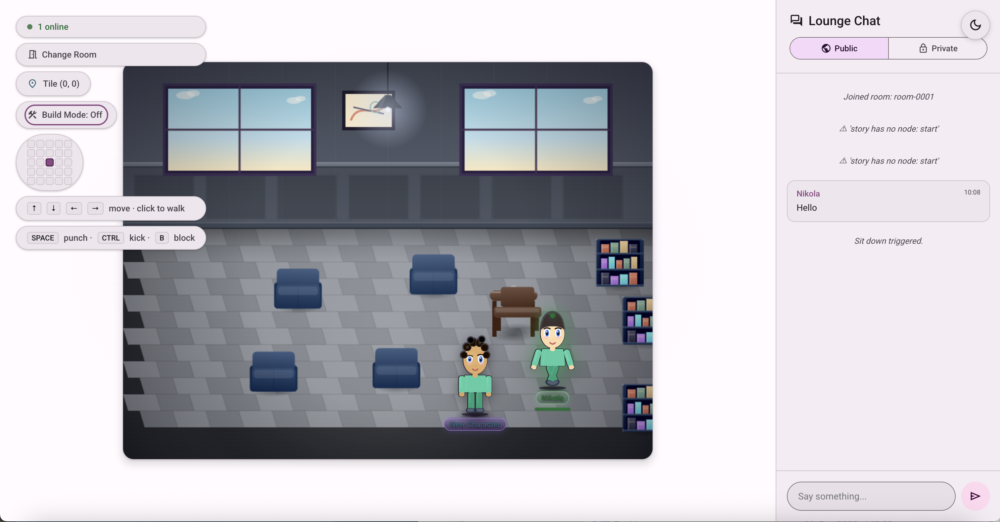

# OmniLaunge

OmniLaunge is a real-time virtual lounge app inspired by social metaverse spaces.
Users create avatars, move through rooms, chat in real time, and interact with world objects.



## What You Can Do

- Create a custom avatar (skin, hair, beard, glasses, clothes, accessories)
- Move via keyboard or click-to-walk
- Chat publicly or privately with other players
- Interact with room objects and radial menus
- Use combat controls (punch, kick, block) with stamina/KO systems
- Explore AI bot interactions and game-like room behavior
- Add AI story characters with editable appearance, scripted conversations, a document-based knowledge base, optional LLM-backed generative answers, and guided tours that walk visitors between waypoints (see [docs/08-ai-characters.md](docs/08-ai-characters.md))

## Educational and Learning-Experience Use Cases

Because rooms, objects, and AI characters are all authorable rather than hardcoded, OmniLaunge works as a general-purpose engine for interactive learning spaces, not just a social lounge. A room author places furniture and characters, wires up knowledge and conversation flows, and gets a persistent multiplayer space that learners can walk into together. Some concrete ways this fits:

- **Virtual classrooms and office hours.** A teacher builds a room per topic or unit, places one or more AI characters as subject-matter guides, and loads each one's knowledge base with the course material (lecture notes, definitions, reference links). Students explore at their own pace, ask the character free-form questions grounded in that material, or follow the scripted conversation graph for a guided walkthrough. Because progress is tracked per user, a class of students can be at different points in the same conversation at the same time.
- **Escape rooms and puzzle-based learning.** The scripted conversation graph's branching choices map naturally onto escape-room logic: a character only reveals the next clue (or the next `nextNodeId`) once a learner has picked the correct choice, and `completion_flag`/`knowledge_check` fields on a node can gate progress on demonstrated understanding. Multiple characters placed around a room can each hold one piece of a larger puzzle, encouraging learners to explore the whole space and piece information together instead of receiving it all from one source.
- **Guided tours and onboarding.** The guided-tour system lets an author drop waypoints around a room and have a character physically walk a learner between them — a museum-style tour through a virtual exhibit, a new-employee walkthrough of a virtual office, or a campus orientation, narrated stop by stop rather than delivered as a wall of text up front. Because starting a tour is a learner action (not permission-gated), any visitor can request "follow me" from a character without needing edit rights to the room.
- **Subject-matter Q&A with citations you control.** Generative mode lets an author connect a character to any OpenAI-compatible endpoint, but every answer is grounded in the documents the author explicitly added to that character's knowledge base — so a character can be scoped to answer only from a specific reading list, policy document, or FAQ rather than the open internet, and it degrades gracefully (falling back to a predefined answer) if the connected model is unavailable, misconfigured, or rate-limited.
- **Language practice and role-play.** A historical-persona or mentor-role character with a curated knowledge base and a branching conversation graph gives learners a low-stakes, repeatable conversation partner — useful for practicing a language, rehearsing a difficult conversation, or exploring a historical scenario from a first-person perspective.
- **Multi-room curricula.** Because rooms are independently created and joined, a course or training program can be structured as a sequence of rooms (one per module or level), each with its own characters, knowledge, and tour, letting an author build a self-paced curriculum without any code changes.

## Tech Stack

- Frontend: Vite, vanilla JavaScript, SVG avatar renderer, Socket.IO client
- UI Design System: hand-built dark theme using [Material Design 3](https://m3.material.io) color/shape/elevation design tokens (`--md-*` CSS custom properties), not the `@material/web` custom-element library — see the auth design doc's "Deliberate deviations" section for why.
- Backend: Python, FastAPI, python-socketio
- Database: PostgreSQL (Docker Compose)
- Testing: Vitest (JS), pytest (Python)

## Documentation

Detailed, split documentation is available in:

- [docs/README.md](docs/README.md)

That index routes to feature-level and functionality-level documents, including architecture and runtime diagrams.

## Repository Structure

```text
client/                 Frontend app (Vite root)
	css/
	js/
server/                 FastAPI + Socket.IO backend
	auth/
	db/
	game/
src/                    Shared JS domain logic (tested in Vitest)
tests/                  JS tests
tests_python/           Python tests
scripts/                Standalone dev-tooling scripts (e.g. .env generation)
docker-compose.yml      Local PostgreSQL + backend services
requirements.txt        Python dependencies
package.json            Node scripts and dependencies
.env.example            Template for every environment variable the server reads (commit-safe)
run.sh / run.bat        Single-command local dev bootstrap (macOS/Linux / Windows)
```

## Quick Start (single command)

```bash
# macOS / Linux
./run.sh
```

```bat
REM Windows
run.bat
```

Either script will, in order:
1. Generate `.env` from `.env.example` if one doesn't exist yet (with a random dev JWT secret and local registration enabled, so you can register/log in immediately without any manual editing).
2. Install Node dependencies (`npm install`) if `node_modules` is missing.
3. Install Python dependencies (`pip install -r requirements.txt`).
4. Start the database, backend, and frontend together (same as `npm run dev` below).

Requires Docker Desktop (or another Docker engine) to already be running -- the script starts the Postgres *container*, not Docker itself.

## Prerequisites

- Node.js 18+
- Python 3.11+
- Docker + Docker Compose (daemon must be running)

## Setup (manual, if you'd rather not use run.sh/run.bat)

```bash
# 1) Copy the environment template and fill in real values (see Configuration below)
cp .env.example .env

# 2) Install Node dependencies
npm install

# 3) Install Python dependencies
pip install -r requirements.txt
```

## Run in Development

Start database, backend, and frontend together:

```bash
npm run dev
```

This runs:
- `docker compose up -d` (database and configured services)
- `python3 -m server.main` (backend on port 8000)
- `vite` (frontend on port 5173)

Open:
- Frontend: http://localhost:5173
- Backend: http://localhost:8000

Tip: Open two or more browser tabs/windows to test multiplayer behavior.

## Run with Docker Services Explicitly

```bash
# Start services
docker compose up -d

# Stop services
docker compose down

# Rebuild backend image
docker compose build server
docker compose up -d server
```

## Test

```bash
# Full test suite
npm test

# JS only
npm run test:js

# Python only
npm run test:python
```

If your local Python environment does not have `pytest`, install dependencies from `requirements.txt` first.

## Build and Run

```bash
# Build frontend assets
npm run build

# Run backend app
npm start
```

## Configuration

There is no static "config file" for authentication or the rest of the server to hand-edit — everything is read from environment variables at startup (see `server/config.py` and `server/auth/config.py`).

```bash
# 1) Copy the template and fill in real values (run.sh/run.bat do this for you automatically)
cp .env.example .env

# 2) Generate a real JWT secret (required -- the server refuses to start without one)
python -c "import secrets; print(secrets.token_urlsafe(48))"
```

`server/main.py` loads `.env` automatically on startup (via `python-dotenv`); a real environment variable (e.g. one set by `docker-compose.yml` or a hosting platform) always takes priority over whatever `.env` contains. `.env` is gitignored — never commit it. `.env.example` documents every variable, grouped by feature (database, auth/JWT, password policy, rate limiting, email, initial admin bootstrap, OAuth2/SSO providers), and is safe to commit since it contains no real secrets.

**Requiring an account for everyone (disabling guest/anonymous play)**: by default (`AUTH_ALLOW_GUEST_ACCESS=true`), anyone can create an avatar and join a room without ever registering — this is the app's original design. Set `AUTH_ALLOW_GUEST_ACCESS=false` to require a real account: the "Continue as a guest" link is hidden on the login page, and an anonymous visitor hitting the main game is redirected to the login page instead of seeing the creator screen. This is a client-side UX gate, not the actual security boundary — combine it with `AUTH_REQUIRE_SOCKET_AUTH=true` (see §16 of the auth design doc) if you also need the *backend* to reject unauthenticated real-time game connections outright.

See [feature_designs/authentication_registration_feature_design.md](feature_designs/authentication_registration_feature_design.md) §0 for a summary of what authentication functionality is implemented vs. still outstanding.

## Environment Notes

- Default PostgreSQL credentials are defined in `docker-compose.yml`:
	- User: `omnilaunge`
	- Password: `omnilaunge`
	- Database: `omnilaunge`
- Backend DB connection can be overridden via `DATABASE_URL`.

## Gameplay Controls

- Movement: Arrow keys or click on floor
- Combat:
	- `Space`: punch
	- `Ctrl`/`Cmd`: kick
	- `B`: block
- Chat: use public/private mode in chat panel

## Contributing

Contributions are welcome. Please follow this workflow:

1. Fork the repo (or create a branch if you have direct access).
2. Create a feature branch:

	 ```bash
	 git checkout -b feature/short-description
	 ```

3. Make focused changes.
4. Add or update tests for behavior changes.
5. Run full test suite locally:

	 ```bash
	 npm test
	 ```

6. Commit with clear messages:

	 ```bash
	 git commit -m "feat: add X"
	 ```

7. Push and open a Pull Request.

### Contribution Guidelines

- Keep PRs small and focused.
- Preserve existing coding style and folder conventions.
- Update documentation when behavior changes.
- Avoid unrelated refactors in feature/fix PRs.

## Troubleshooting

- Port already in use:
	- Check 5173, 8000, and 5432 for conflicts.
- No backend response:
	- Confirm Docker DB is up and backend process is running.
- Tests failing unexpectedly:
	- Reinstall dependencies and rerun targeted test commands.

## License

This project is licensed under the MIT License — see [LICENSE](LICENSE) for the full text.
