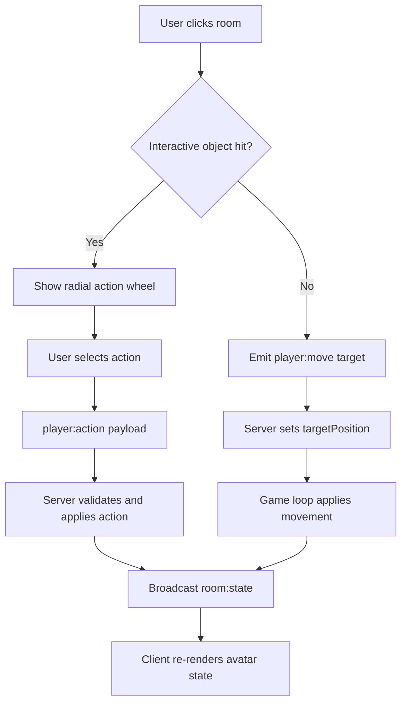

# Room Interactions and Spatial Behavior

Room interaction in OmniLaunge is built around the idea that actions should emerge from place. Furniture is not decorative only; each interactive object defines one or more action entries with target anchor coordinates and resulting avatar action states. This design gives users consistent spatial feedback because action outcomes happen near the object that initiated them.

The radial menu module is responsible for interaction presentation. It places actions around a center node with staggered animation timing and object icon labeling. The wheel appears where the user clicked, so users maintain context rather than losing focus to a separate panel.

The object model currently includes sofas, a coffee table, and a DJ deck with actions such as sitting, lounging, drinking, climbing, dancing, and DJing. Some actions use normal walk-to-target semantics and some use explicit teleport handling when collision constraints would otherwise block a physically impossible endpoint.

Movement itself is bounded and obstacle-aware. The backend defines room limits and furniture collision boxes, then resolves movement with a full-position check and axis slide fallback strategy. This means users can move naturally around room geometry while avoiding most clipping artifacts.

This spatial interaction model is one of the strongest foundations for future expansion into richer room authoring because it already treats behavior as room-anchored state transitions rather than hardcoded global commands.