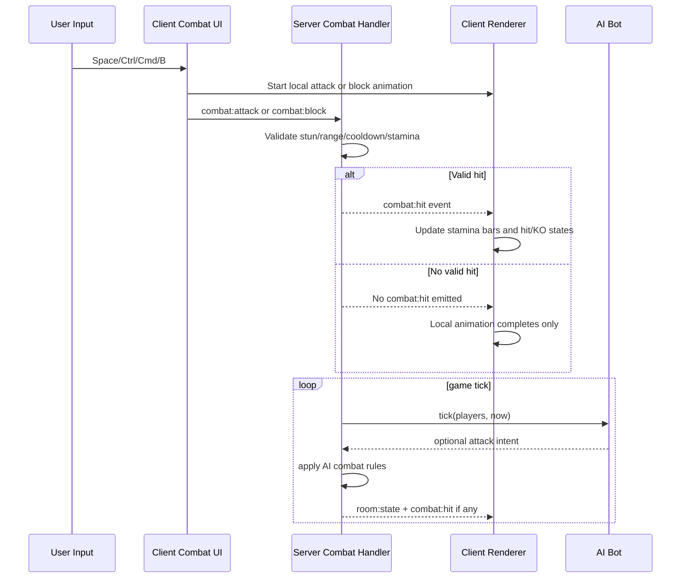

# Combat, Stamina, and AI Bot Behavior

Combat in OmniLaunge has three coordinated layers: client-side input and animation start, server-side authority and validation, and client-side reconciliation through events. This keeps controls responsive while preserving deterministic multiplayer outcomes.

Users can trigger punch, kick, and block from keyboard shortcuts. Punch and kick begin immediately as local animation, including air attacks when no valid target is in range. The server decides whether a hit exists and whether damage should be applied. Blocking state is represented continuously while the key is held.

Stamina and damage rules are defined on the backend. Punch and kick have distinct damage values, stamina costs, ranges, and cooldown windows. Blocking reduces incoming damage. When stamina reaches zero, the target enters a stun state for a long duration and cannot move or attack until the stun window expires.

The animation layer uses curve-driven limb rotation with directional awareness. Punches and kicks use phase curves so movement feels like wind-up, extension, and retract rather than binary pose swaps. A key implementation detail is that SVG limb swing direction depends on sign convention around top pivots, and this is now explicitly tested to prevent inverted motion regressions.

RoboFighter, the AI bot, is integrated into the same authoritative game loop and follows practical combat heuristics. It chooses nearest targets, approaches when outside attack range, blocks with probability, and chooses punch versus kick using weighted randomness. It can also send periodic taunt messages when near players.

Because combat spans both prediction-like local animation and strict server validation, contributors should always test both gameplay correctness and visual directionality when touching these modules.