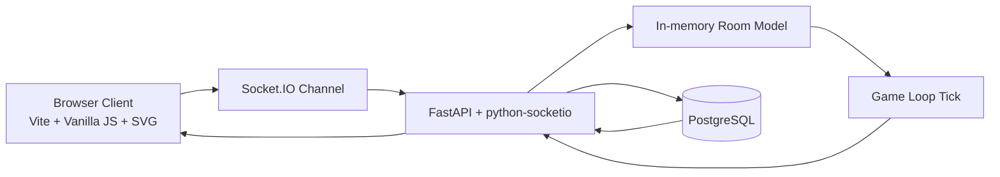
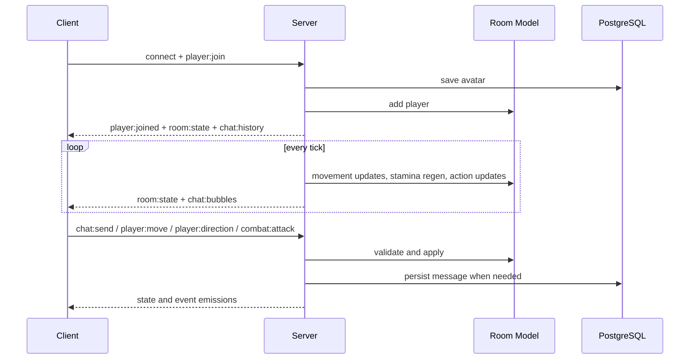

# System Architecture

OmniLaunge is structured as a browser client, a real-time Python server, and a PostgreSQL persistence layer. The architecture prioritizes low complexity and high runtime clarity. The frontend owns immediate rendering, input capture, and local animation timing. The backend owns canonical room state, validation logic, and periodic simulation. The database stores durable identity and chat data.

The application is intentionally stateful in memory on the server for active room behavior. That allows simple and fast tick updates without an external state broker. Durability is applied where persistence is needed today: avatar profiles and messages.

The frontend entry point coordinates subsystems such as avatar rendering, room renderer, radial menu behavior, combat input, and chat UI. The backend entry point wires lifecycle management, socket event handlers, database connection pool setup, and game loop startup.

A practical implication for contributors is that many visible behaviors are formed by composition of modules rather than single-function logic. For example, combat feedback on screen involves input handling, attack animation curves, server validation, hit events, room-state updates, and renderer flags. System-level reasoning is therefore more reliable than isolated file reading for debugging.

## Runtime Timeline

This architecture has been stable for iterative feature growth and remains a solid base for future multi-room and educational expansion.