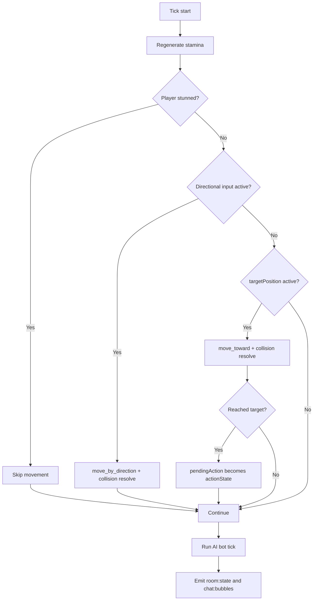

# Backend Runtime and Game Loop Internals

The backend runtime centers around three responsibilities that execute continuously: maintaining room authority, processing user intents, and advancing the simulation tick. FastAPI provides process lifecycle and HTTP serving support, while python-socketio handles low-latency bidirectional communication.

The runtime now includes a multi-room registry foundation. Instead of a single hardcoded room object, the server maintains a registry that can create rooms, list room summaries, map players to current rooms, and switch membership between rooms.

At startup, the server opens a PostgreSQL pool, spawns the AI bot in the room, and starts a background loop task. At shutdown, it cleanly cancels the loop and closes database resources. This lifecycle pattern avoids hidden global thread state and keeps startup/shutdown deterministic.

The room model stores player records with position, movement direction, targetPosition, action state, pendingAction, stamina, block status, stun timestamp, and attack cooldown timestamps. This compact state shape is enough for the current lounge behavior while remaining easy to inspect during debugging.

The tick loop processes player updates in a fixed cadence. It regenerates stamina, skips movement for stunned players, applies directional movement, applies click-target movement, resolves arrival-triggered pending actions, runs AI behavior, emits combat hit events when needed, and then broadcasts state and bubbles.

## Socket Event Responsibilities

The server accepts join, movement, directional input, object actions, chat send, combat attack, and combat block events. It also now accepts room discovery and selection events: room:list, room:create, and room:join. For each event, the server either mutates room state directly after validation or records intent that the tick loop resolves. This separation is important: movement intents are cheap event writes, while actual movement progression remains tick-governed.

## Important Runtime Constraints

Movement is collision-aware and bound-clamped. Combat is range and stamina constrained. Stun blocks movement and attacking. Chat visibility can be global or recipient-limited. AI behavior obeys the same core combat constraints as players.

A known code-health note is that the direction setter currently contains unreachable lines after an early return, suggesting intended target-clearing logic that does not execute. This should be addressed in a focused refactor, ideally with corresponding tests.