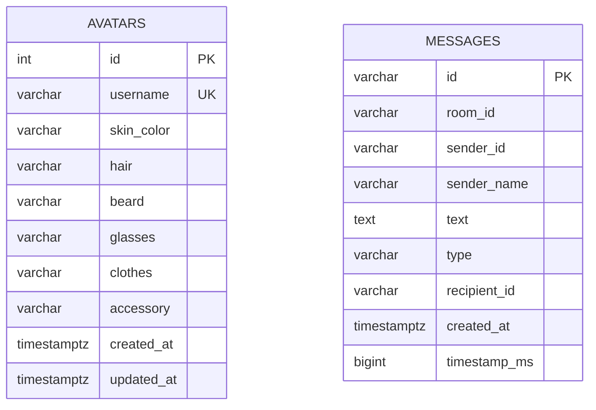
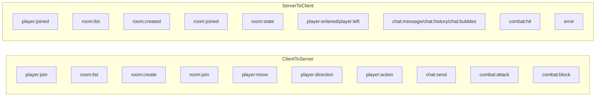

# Data, Events, and Storage Contracts

This document summarizes the practical contract layer of OmniLaunge: what data is persisted, what state is ephemeral, and how major socket events shape runtime behavior.

## Persistent Data

Two domains are currently persisted in PostgreSQL. The first domain is avatar profile data keyed by username, with upsert behavior so users can refresh their profile without duplicate identities. The second domain is chat message history with room id, sender metadata, message type, recipient id for private messages, and timestamp fields.

## Ephemeral Runtime State

Room occupancy, live positions, movement intent, action states, block state, stamina, and stun windows are currently in-memory state. This makes tick simulation straightforward and low overhead for a single-room deployment model.

## Event Contract Overview

The event surface is intentionally small but expressive. Join events establish identity and initial state. Movement and direction events express intent. Object action events carry target anchor coordinates and optional teleport flags. Chat events carry message payloads and type. Combat events split between attack requests, block-state updates, and server-generated hit outcomes.

The event surface now includes room discovery and room switching primitives. Clients can request room lists, create new rooms with metadata, and join selected rooms, after which room-specific state and message history are returned.

Room metadata is currently in-memory through the room registry foundation layer, while avatar and chat persistence remain PostgreSQL-backed.

## Practical Notes for Contributors

Event payload changes must be coordinated between backend handlers and frontend reducers/renderers in the same commit. This is especially critical for combat payloads, because stamina and stun updates are consumed by both UI and animation logic.

If a new persistent domain is introduced, add corresponding schema migration, data access methods, and explicit error behavior for unavailable resources. Avoid silent partial writes in chat or identity paths.