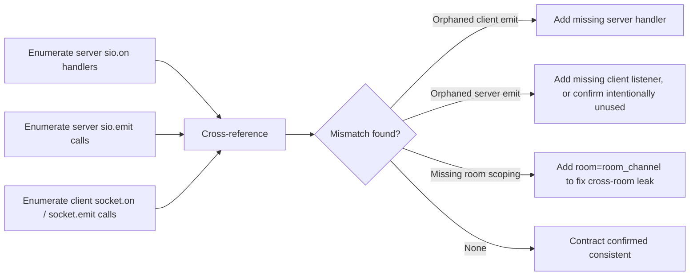

# Testing, Operations, and Release Discipline

OmniLaunge is maintained through a mixed-language testing strategy and a pragmatic local operations workflow. JavaScript behavior is validated through Vitest suites under the tests folder, while Python behavior is validated through pytest suites under tests_python.

The project has repeatedly used TDD cycles for high-risk animation and combat changes, including explicit geometric tests to protect SVG sign conventions. That said, visual correctness for avatar motion still requires browser verification because mathematically consistent curves can still look incorrect when mapped through rendering pivots.

## Test Surface

JavaScript tests cover movement logic, room logic, chat helpers, combat calculations, attack animation curves, and avatar renderer behavior. Python tests cover movement primitives, room management behavior, chat logic, avatar validation, and socket handler integration (tests_python/test_main_*.py, using a fake Socket.IO server so no real network I/O occurs). Coverage also now extends to two previously-untested infrastructure modules: server/config.py (env var defaults and type coercion, verified via importlib.reload under controlled environment variables) and server/db/database.py (avatar/message persistence methods, verified against a hand-rolled fake asyncpg pool/connection so no real Postgres connection is required).

Contributors should run full suites before pushing. For partial work, targeted suites are acceptable during iteration, but final validation should remain full-stack where feasible.

## Socket Event Contract Audits

Because the client and server agree on event names only by convention (plain strings, no shared schema/codegen), event contract drift is a standing risk: a renamed or newly-added event on one side that isn't mirrored on the other fails silently at runtime with no error, only a dropped or unhandled message. Periodically cross-reference the full set of server @sio.on(...) handlers and sio.emit(...) calls in server/main.py against state.socket.on(...) and state.socket.emit(...) calls in client/js/main.js, and confirm every server-side room-targeted emit passes room=room_channel(room_id) rather than broadcasting globally.

## Local Runtime Model

The standard local model runs frontend and backend directly while using Docker Compose for PostgreSQL and containerized backend scenarios. Vite hot reload supports rapid frontend iteration. The backend can run either directly via python module invocation or inside Docker service context depending on the change scope.

## Release Hygiene

A high-quality change in this repository generally includes synchronized updates to mirrored modules when applicable, test updates near behavioral changes, and documentation updates when user-visible behavior changes. Because the app is real-time and stateful, release confidence improves when contributors test multiplayer behavior in at least two browser sessions.

## Operational Risks to Watch

The most common runtime risks are event contract drift between client and server, visual regressions in combat directionality, and stale assumptions about in-memory versus persisted state. The most common process risk is modifying only one side of duplicated logic modules and forgetting to sync runtime copies.

## Suggested Release Checklist Narrative

Before release, validate that application startup works from a clean checkout, that avatar creation and room entry succeed, that movement and object interactions remain responsive, that chat works in both public and private modes, and that combat still obeys server authority while matching expected directional visuals. Once these checks pass with tests green, package and push.